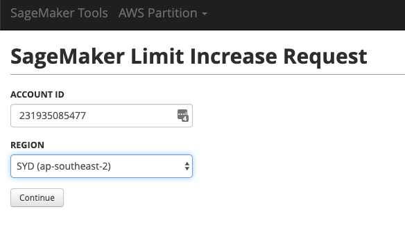
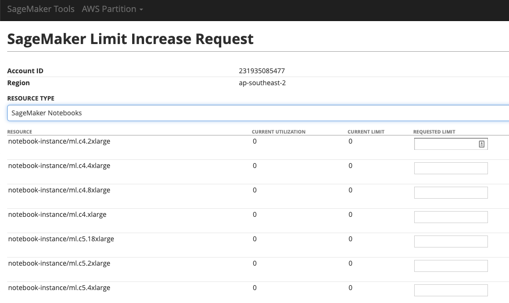
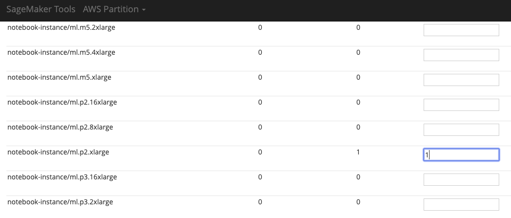
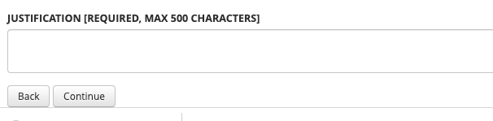
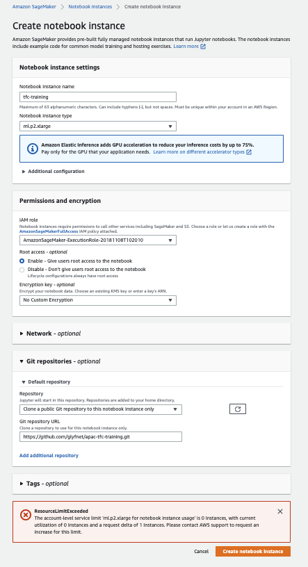

# APAC Machine Learning TFC Training 

## Setup

This training course was adapted form the machine learning accelerator materials. It has been adapted to run outside of Eider.

### SageMaker Setup

#### Limit Increase for GPU

For the CV1 lab, we will be using GPU SageMaker notebook instances. You will need to request a limit increase +1 for a p2 instance.

1. Increase your [SageMaker Limits](https://sagemaker-tools.corp.amazon.com/limits)

2. Enter your account and preferred region

3. Select Notebooks

4. Increase notebook-instance/ml.p2.xlarge limit to 1

5. Set justification to "ML TFC training for computer vision"

6. Submit the form. You will receive an automated reply via email, and will immediately be able to spin up a notebook of that instance type.

#### Create SageMaker Notebook
Now create a SageMaker notebook in the same region. Use the following settings:
* Notebook instance name: tfc-training
* Notebook instance type: ml.p2.xlarge
* Additional configuration -> lifecycle configuration -> on start: Copy [this script](https://raw.githubusercontent.com/aws-samples/amazon-sagemaker-notebook-instance-lifecycle-config-samples/master/scripts/auto-stop-idle/on-start.sh) to insure the notebook will shut down automatically after 1 hour of idle time. 
* IAM role - use default role
* Git repository -> Default repository -> Repository: "Clone a public git repository"
* Git repository -> Default repository -> Git Repository Url: "https://github.com/glyfnet/apac-tfc-training.git"
* Hit Create a notebook instance
If you see resource limit exceeded error, check you increased limits in same region,a nd that you dont have any other notebooks of that instance type running.
* Wait for the notebook to start. 
* Open with Jupyter. 
* You should see all the course notebooks pulled from the git repo.

